# Claude Trace System

A comprehensive tracing and observability system for Claude Code workflows, with hierarchical task visualization and cost analytics.

## 📚 Documentation

This system is documented across several files:

1. **[claude-trace-system.md](./claude-trace-system.md)** - Complete architecture and design
   - System architecture diagrams
   - Data models and schemas
   - Integration with Beads task tracker
   - Storage strategies (JSONL → SQLite → Time-series DB)
   - Implementation phases

2. **[claude-trace-quickstart.md](./claude-trace-quickstart.md)** - Hands-on implementation guide
   - Go project structure
   - Phase 1 MVP implementation
   - Working code examples
   - Build and installation instructions
   - Testing and debugging tips

3. **[claude-trace-dashboard-examples.md](./claude-trace-dashboard-examples.md)** - Dashboard design
   - Mermaid diagram mockups
   - SQL query examples
   - REST API design
   - Real-time updates (SSE)
   - React component examples

## 🎯 Vision

Build a dashboard that provides:

```
Dashboard
├── Task Hierarchy (Mermaid diagram with drill-up/drill-down)
│   ├── Task ID
│   ├── Status (visual indicators)
│   ├── Parent/child relationships
│   └── Metrics (time, tokens, cost)
├── Timeline View
│   └── Chronological tool usage with durations
├── Cost Analytics
│   ├── Token usage by tool
│   ├── Cost over time
│   └── Efficiency metrics
└── Session Management
    └── Filter, search, and export traces
```

### Interactive Features

- **Click nodes** → Drill into task details
- **Hover** → Show inline metrics
- **Expand/collapse** → Navigate hierarchy
- **Real-time updates** → Watch tasks as they execute
- **Export** → Generate reports and share findings

## 🏗️ Architecture Overview

```
Claude Code
    ↓ (hook events via stdin JSON)
claude-trace binary (Go)
    ↓ (parse, enrich, compute metrics)
.claude/traces/*.jsonl (append-only log)
    ↓ (index for queries)
SQLite database
    ↓ (REST API)
Aggregator Service (Go)
    ↓ (HTTP + SSE)
Dashboard Frontend (React)
```

## 🚀 Quick Start

### Phase 1: MVP Hook (Week 1)

**Goal:** Capture tool usage to JSONL files

```bash
# 1. Create Go project
mkdir claude-trace && cd claude-trace
go mod init github.com/yourusername/claude-trace

# 2. Implement basic hook (see quickstart guide)
# 3. Build binary
make build

# 4. Install to project
make install-local

# 5. Configure hook in .claude/settings.json
# 6. Test with Claude
```

See **[claude-trace-quickstart.md](./claude-trace-quickstart.md)** for detailed steps.

### Verify It's Working

```bash
# Check for trace files
ls -la .claude/traces/

# View traces
cat .claude/traces/traces-2024-01-31.jsonl | jq

# Query sessions
go run ./cmd/trace-query sessions
```

## 📊 Example Output

### Trace Event (JSONL)

```json
{
  "trace_id": "trace-abc123",
  "span_id": "span-xyz789",
  "parent_id": null,
  "session_id": "session-abc123",
  "task_id": "NOV-100",
  "task_status": "in_progress",
  "timestamp": "2024-01-31T10:15:30Z",
  "duration_ms": 1250,
  "event_type": "post_tool_use",
  "hook_type": "PostToolUse",
  "tool_name": "Edit",
  "tool_input": {
    "file_path": "/path/to/file.go",
    "old_string": "...",
    "new_string": "..."
  },
  "metrics": {
    "files_edited": 1,
    "input_tokens": 150,
    "output_tokens": 80,
    "estimated_cost": 0.015
  },
  "tags": {
    "task_title": "Implement Authentication"
  }
}
```

### Dashboard View (Mermaid)

```mermaid
graph TB
    root["NOV-100: Auth System<br/>2h 15m | $3.50 | 45K tokens"]
    root --> child1["NOV-123: JWT ✅"]
    root --> child2["NOV-124: Login 🟡"]
    root --> child3["NOV-125: Tests ⚪"]
    child2 --> sub1["NOV-126: Validate ✅"]
    child2 --> sub2["NOV-127: Token 🟡"]
```



## 🎨 Key Features

### 1. Hierarchical Task Tracking
- Link traces to Beads tasks automatically
- Show parent/child relationships
- Visual status indicators (✅ 🟡 🔴 ⚪)

### 2. Cost & Token Analytics
- Track token usage per tool
- Compute estimated costs
- Identify expensive operations
- Optimize prompts based on data

### 3. Timeline Visualization
- See tool execution chronologically
- Identify bottlenecks
- Debug failed operations
- Replay sessions

### 4. Real-Time Updates
- Watch tasks as they execute
- Server-Sent Events (SSE)
- Live metrics updates

### 5. Powerful Queries
- SQL-based analytics
- Pre-built dashboard queries
- Custom reporting
- Export capabilities

## 🛠️ Tech Stack

### Backend (Go)
- **Hook Binary**: Captures and processes events
- **Aggregator API**: REST endpoints + SSE
- **Storage**: JSONL + SQLite

### Frontend (React/Next.js)
- **Mermaid.js**: Task hierarchy diagrams
- **Recharts**: Cost analytics charts
- **React Flow**: Alternative for complex graphs
- **Tailwind CSS**: Styling

### Optional Future Stack
- **ClickHouse**: OLAP queries for scale
- **TimescaleDB**: Time-series analytics
- **Docker**: Easy deployment

## 📈 Implementation Phases

### ✅ Phase 1: MVP Hook (Week 1)
- Basic event capture
- JSONL storage
- Simple CLI queries

### 🔄 Phase 2: Beads Integration (Week 2)
- Link traces to tasks
- Capture hierarchy
- Task status tracking

### 🔄 Phase 3: Metrics & Aggregation (Week 3)
- Token counting
- Cost calculation
- SQLite indexing

### 🔄 Phase 4: Aggregator API (Week 4)
- REST endpoints
- Real-time updates (SSE)
- Query optimization

### 🔄 Phase 5: Dashboard UI (Week 5-6)
- React/Next.js app
- Mermaid diagrams
- Cost analytics charts
- Interactive navigation

### 🔄 Phase 6: Polish & Scale (Week 7+)
- Data retention policies
- Performance optimization
- Cloud deployment
- Documentation

## 🔍 Comparison to Example Hook

You mentioned the [destructive_command_guard](https://github.com/Dicklesworthstone/destructive_command_guard) hook as reference.

### Similarities
- ✅ Reads JSON from stdin
- ✅ Processes hook events synchronously
- ✅ Returns exit code (0 = success, non-zero = block)
- ✅ Can inspect tool inputs/outputs

### Our Additions
- ✨ Structured trace format with hierarchy
- ✨ Integration with Beads task tracker
- ✨ Token/cost metrics tracking
- ✨ Persistent storage (JSONL + SQLite)
- ✨ Aggregator API for queries
- ✨ Dashboard for visualization
- ✨ Real-time updates
- ✨ Multi-session analytics

### Key Difference

The `destructive_command_guard` is a **safety hook** (blocking dangerous commands).

Our `claude-trace` is an **observability hook** (capturing telemetry for analysis).

Both are valid hook patterns:
- **Blocking hooks** → Exit non-zero to prevent execution
- **Observability hooks** → Exit 0, log data for later analysis

## 🔗 Integration Points

### With Beads Task Tracker

```go
// Read current task from .beads/issues/
task := getCurrentBeadsTask()

// Add task context to trace
trace.TaskID = task.ID
trace.TaskStatus = task.Status
trace.ParentID = task.ParentID
```

### With Fractal Orchestrator (from brainstorm.md)

The tracing system aligns perfectly with your orchestrator design:

```
Planner → creates tasks in Beads
    ↓
Worker → executes leaf tasks
    ↓
claude-trace → captures all tool usage
    ↓
Dashboard → shows task tree + metrics
    ↓
Human → drills down to debug/optimize
```

### With Claude Hooks

Hook events come from three sources:

1. **PreToolUse**: Before tool executes
   - Capture intent
   - Start span timer

2. **PostToolUse**: After tool completes
   - Capture result
   - Compute duration
   - Count tokens/cost

3. **UserPromptSubmit**: User message
   - Capture prompt
   - Link to trace

## 📝 Configuration

### Minimal Hook Setup

Add to `.claude/settings.json`:

```json
{
  "hooks": {
    "PreToolUse": [{
      "matcher": ".*",
      "hooks": [{
        "type": "command",
        "command": "$CLAUDE_PROJECT_DIR/.claude/hooks/claude-trace"
      }]
    }],
    "PostToolUse": [{
      "matcher": ".*",
      "hooks": [{
        "type": "command",
        "command": "$CLAUDE_PROJECT_DIR/.claude/hooks/claude-trace"
      }]
    }]
  }
}
```

### Environment Variables

```bash
# Enable debug logging
export CLAUDE_TRACE_DEBUG=1

# Custom storage location
export CLAUDE_TRACE_DIR=/path/to/traces

# Hook type (set automatically by Claude)
export CLAUDE_HOOK_TYPE=PostToolUse
```

## 🐛 Debugging

### Check Hook Execution

```bash
# Test hook directly
echo '{"session_id":"test","tool_name":"Read","timestamp":"2024-01-31T10:00:00Z"}' | \
  CLAUDE_HOOK_TYPE=PostToolUse \
  ./.claude/hooks/claude-trace

# Check exit code
echo $?  # Should be 0
```

### View Logs

```bash
# Watch trace files in real-time
tail -f .claude/traces/current.jsonl | jq

# Count events by tool
cat .claude/traces/*.jsonl | jq -r '.tool_name' | sort | uniq -c
```

### Common Issues

1. **Hook not executing**
   - Check file permissions: `chmod +x .claude/hooks/claude-trace`
   - Verify path in settings.json
   - Check Claude logs

2. **Missing traces**
   - Ensure `.claude/traces/` directory exists
   - Check write permissions
   - Look for errors in stderr

3. **Slow performance**
   - Hook should complete in <100ms
   - Use buffered writes
   - Consider async mode

## 📚 Resources

### Documentation
- [System Design](./claude-trace-system.md)
- [Quick Start Guide](./claude-trace-quickstart.md)
- [Dashboard Examples](./claude-trace-dashboard-examples.md)

### External References
- [Claude Hooks Documentation](https://code.claude.com/docs/en/hooks)
- [Example Hook: Destructive Command Guard](https://github.com/Dicklesworthstone/destructive_command_guard)
- [OpenTelemetry Tracing](https://opentelemetry.io/docs/concepts/signals/traces/)
- [Mermaid.js Diagrams](https://mermaid.js.org/)

### Related Tools
- [Beads Task Tracker](https://github.com/beadslabs/beads) (integrated)
- [Jaeger](https://www.jaegertracing.io/) (inspiration for UI)
- [LangSmith](https://www.langchain.com/langsmith) (LLM observability)

## 🤝 Contributing

This is currently a design/planning document. Implementation will follow the phased approach outlined above.

### Next Steps

1. **Review this design** - Validate the approach
2. **Choose tech stack** - Confirm Go + React
3. **Build Phase 1** - MVP hook binary
4. **Test with workflow** - Use with real tasks
5. **Iterate** - Refine based on feedback

## 📄 License

TBD

## 🙏 Acknowledgments

- Inspired by OpenTelemetry distributed tracing
- Dashboard concepts from Jaeger and LangSmith
- Hook pattern from Claude Code docs
- Architecture aligned with your [brainstorm.md](../brainstorm.md)

---

**Ready to build?** Start with the [Quick Start Guide](./claude-trace-quickstart.md)!
