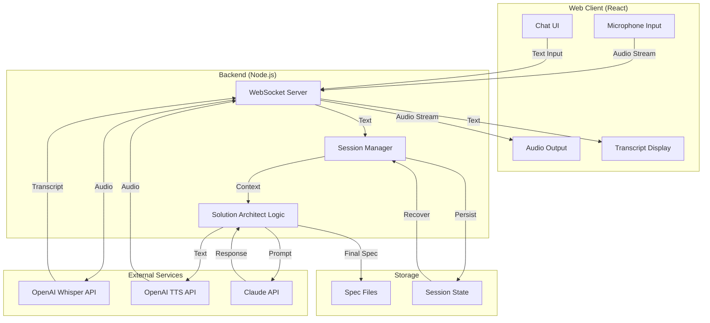

# Solution Specification: Web Voice Planner

## Summary

A voice-enabled web app that lets PMs have spoken conversations with solution-architect to design what to build. It provides a real-time voice interface (like a voice assistant) that makes the solution-architect workflow accessible to non-technical users who prefer speaking over typing.

## User Value

**Target User:** Product Managers who have a feature idea but need to define specs clearly.

**Trigger:** PM wants a new feature and needs to articulate it well enough for engineering to implement.

**Prerequisite:** Must know what they want to build. If they're still unclear on the problem, they should use `/problem:plan` first.

**User Journey:**
1. PM opens the web app with a feature idea in mind
2. PM speaks naturally to describe what they want to build
3. Solution-architect guides them through the design process via voice
4. PM receives a complete solution spec (UX flow, mermaid diagram, high-level plan)
5. Spec is auto-saved for engineering to access and implement

**Value Delivered:** PM can hand the spec directly to engineering with minimal back-and-forth needed during implementation.

## Scope

### Included
- Real-time voice conversation interface
- Text input as fallback/alternative to voice
- Visible transcript for review and correction
- Integration with solution-architect logic
- Auto-save specs to accessible location for engineers
- Session persistence (recoverable after connection drops)

### Excluded
- No `/problem:plan` flow (v1 is solution-architect only)
- No spec editing after generation
- No user authentication or login
- No matching existing codebase patterns (greenfield)

### Future Considerations
- `/problem:plan` integration for users who don't know what to build yet
- User accounts and session history
- Collaborative editing of specs
- Integration with project management tools

## Success Criteria

1. Engineers can implement features with minimal back-and-forth—human decisions are already made in the spec
2. Edge cases are captured upfront in the spec, not discovered during implementation
3. Voice sessions complete quickly—PMs don't feel bogged down by the process
4. PMs prefer speaking over typing for this workflow

## Technical Constraints

- **Speech-to-Text:** OpenAI Whisper
- **Text-to-Speech:** OpenAI (preferred)
- **Architecture:** Greenfield project, clean slate
- **Tech Stack:** Open to recommendation, optimized for real-time voice (recommendation: React + Node.js with WebSocket for real-time communication)
- **Integration:** Must integrate with solution-architect logic (method flexible—can reuse prompts directly with Claude API)

## Edge Cases

| Scenario | Severity | Recommendation |
|----------|----------|----------------|
| Misheard voice input | Medium | Show live transcript so PM can see and correct misunderstandings |
| Connection drops mid-session | High | Persist conversation state; allow session recovery without data loss |
| PM prefers typing for part of session | Low | Support both voice and text input simultaneously in the same session |
| PM steps away mid-conversation | Low | No session timeout—conversation waits indefinitely until PM returns |
| Noisy environment | Medium | Provide clear audio indicators; allow text fallback |
| External API failures (Whisper/TTS/Claude) | High | Show graceful error message; allow text-only fallback mode when voice APIs fail |
| User interrupts TTS playback | Medium | Add "stop speaking" button; immediately halt audio when user starts talking or clicks stop |
| Concurrent audio (user speaks while TTS playing) | Medium | Auto-pause TTS when microphone detects input; or implement push-to-talk mode |
| Long Claude responses | Low | Stream TTS in chunks rather than waiting for full response; show text progressively |
| High network latency | Medium | Show "processing" indicators; consider local audio buffering |
| Browser denies microphone permission | High | Detect permission denial; prominently show text input as primary mode |
| Multiple tabs with same session | Low | Either sync state across tabs or show "session active elsewhere" warning |
| Spec file save failure | High | Retry with exponential backoff; keep spec in memory/session until confirmed saved |
| WebSocket reconnection | Medium | Auto-reconnect with backoff; show connection status indicator in UI |

## UX Flow

```
+------------------------------------------+
|           Web Voice Planner              |
+------------------------------------------+
|                                          |
|  +------------------------------------+  |
|  |                                    |  |
|  |         Chat Transcript            |  |
|  |                                    |  |
|  |  [Assistant]: What solution are    |  |
|  |  you thinking about?               |  |
|  |                                    |  |
|  |  [You]: I want to add a voice...   |  |
|  |  (click to edit)                   |  |
|  |                                    |  |
|  +------------------------------------+  |
|                                          |
|  +------------------------------------+  |
|  | Type a message...          [Send]  |  |
|  +------------------------------------+  |
|                                          |
|        [    Speak    ]                   |
|         (microphone button)              |
|                                          |
+------------------------------------------+
```

## Implementation Diagram



## Effort Estimate

**Size:** M (Medium)

**Reasoning:**
- Core functionality (voice chat with solution-architect) is well-defined
- Uses established APIs (OpenAI Whisper, TTS, Claude) rather than building from scratch
- Greenfield means no legacy constraints, but also requires full setup
- Real-time voice adds complexity over simple text chat
- Session persistence and recovery adds moderate complexity

**Confidence:** High (all dimensions strong or partial with clear evidence)

---
Generated by Solution Architect v2
Confidence: HIGH
